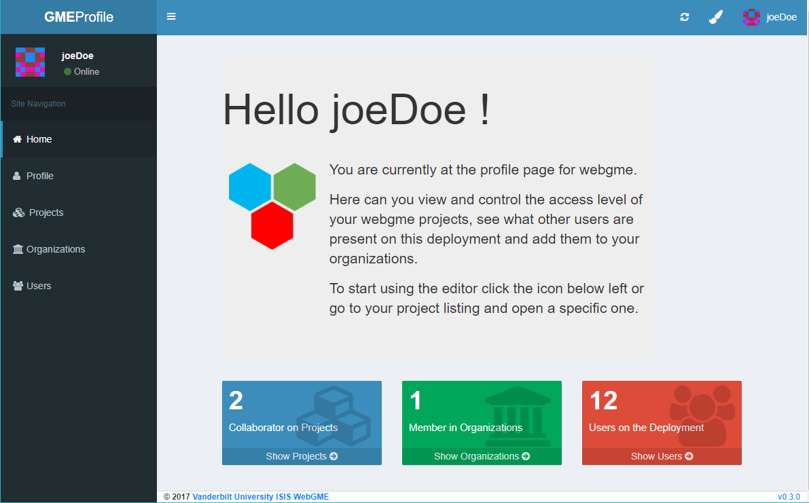

[](https://travis-ci.org/webgme/user-management-page)
[](https://www.npmjs.com/package/webgme-user-management-page)
[](https://opensource.org/licenses/MIT)

### A webpage for users to manage their webgme account and projects. 
`webgme-user-management-page` runs as a dependency of [webgme](https://github.com/webgme/webgme) and is available at `<host>/profile`
when [authentication is enabled](https://github.com/webgme/webgme/wiki/Users-and-Authentication). The purpose is to
allow for registration and login, project authorization of other users/organizations, and creation of
organizations as well as member/admin control for those organizations.

For instructions on webgme authentication and user-management see [this demo on youtube](https://www.youtube.com/watch?v=xS6_FK8kZhE).

Since webgme [v2.15.0](https://github.com/webgme/webgme/releases/) you can easily fork and modify this page to fit your needs
and replace the mounted user-management-page point to your customization.



## Developers
#### Steps to run as an external REST router within WebGME

WebGME requires [NodeJS](https://nodejs.org/) (0.12 <= version, CI tests are performed on versions 4.x, 6.x) and [MongoDB](https://www.mongodb.com/) (version >= 2.6) installed on the host system (the server).
In addition the npm installation requires [Git](https://git-scm.com) to be installed and available in PATH.

1. Ensure dependencies are installed and mongodb is running on default port 
2. Install dependencies `npm install`
3. Run webpack `npm run webpack`
4. Start (webgme) server `npm start`
5. From a browser visit `http://localhost:8888/usermanagement/`


#### Webpack file listener
To build client side bundle on file changes invoke
```
webpack -w
```
or if not installed globally
```
npm run webpack -- -w
```

##### Publish
Delete all unversioned files in `/dist/**`
```
npm prune
npm install
npm version 0.3.0 -m "Release %s"
git push origin master
git checkout v0.3.0
git push origin v0.3.0
npm publish ./
```
